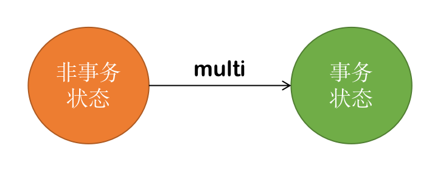
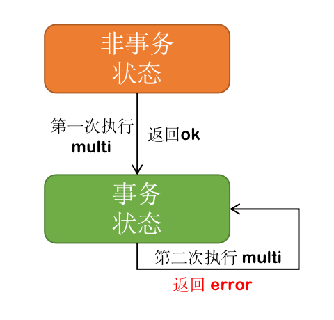
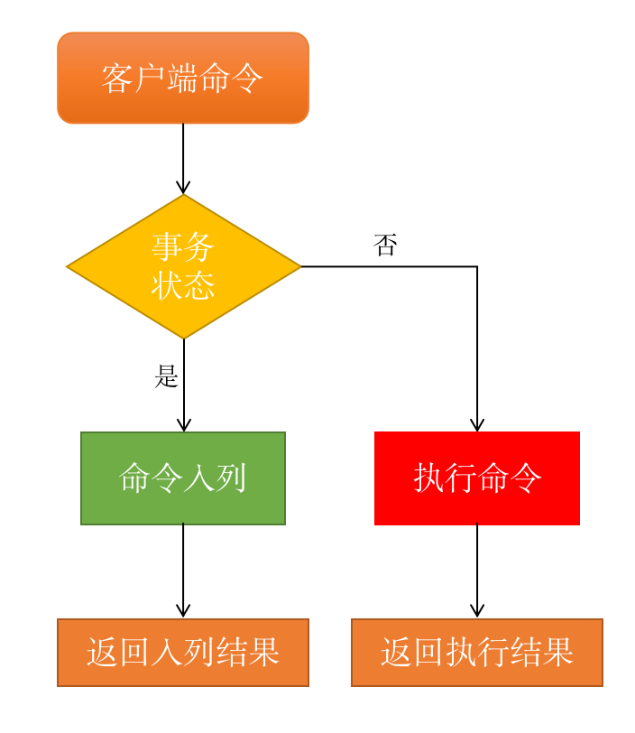
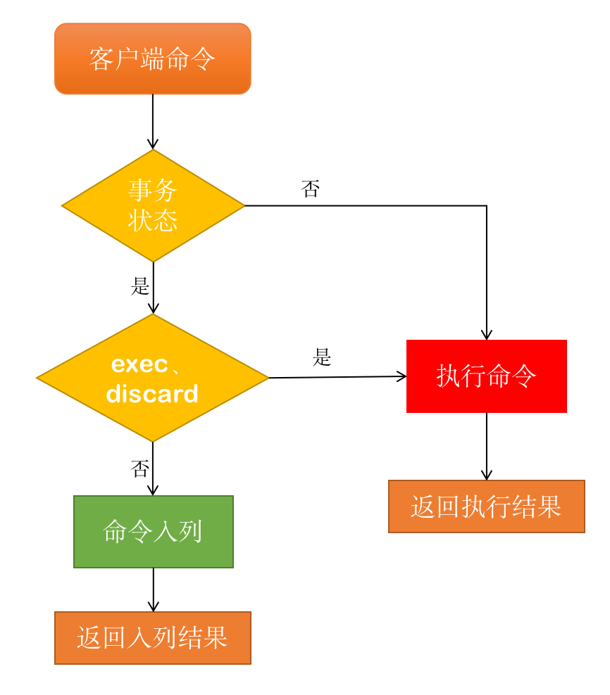
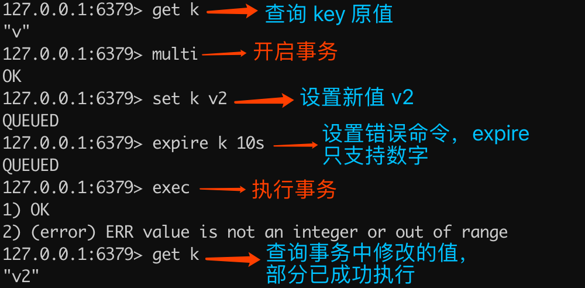
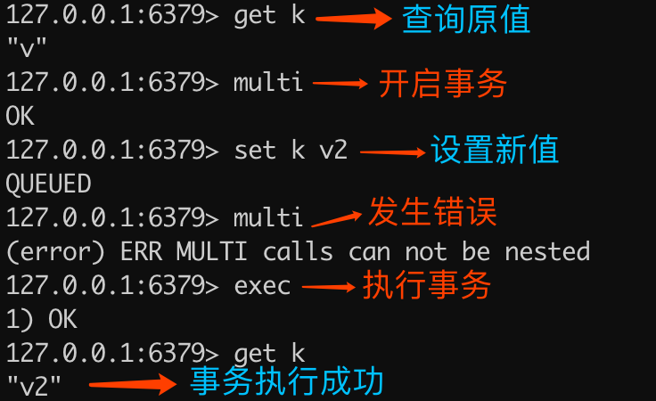
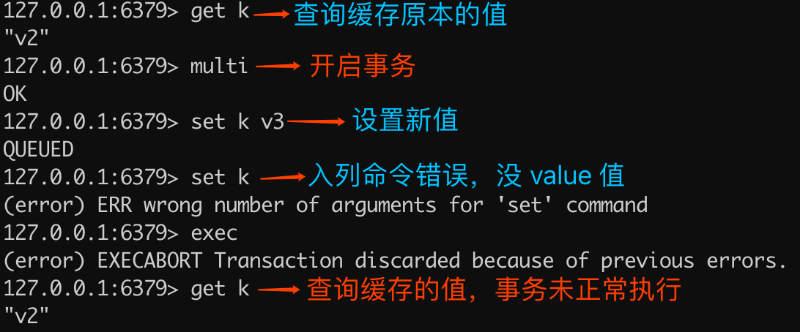
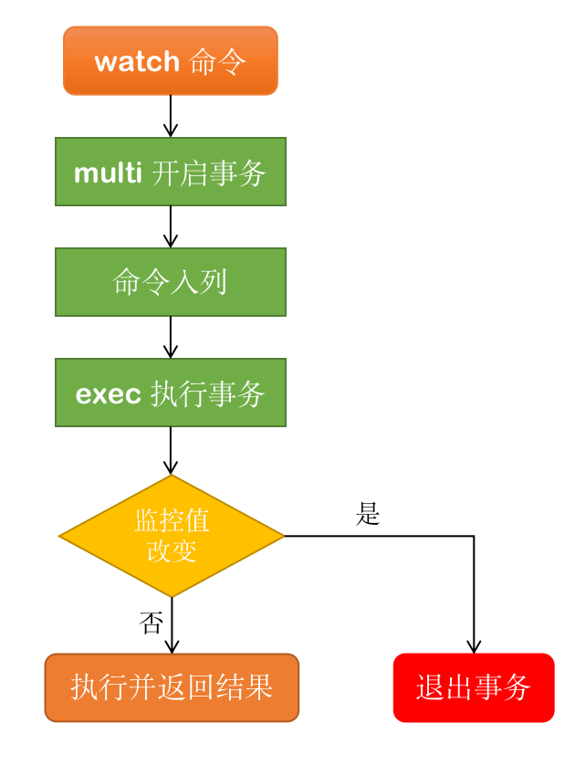
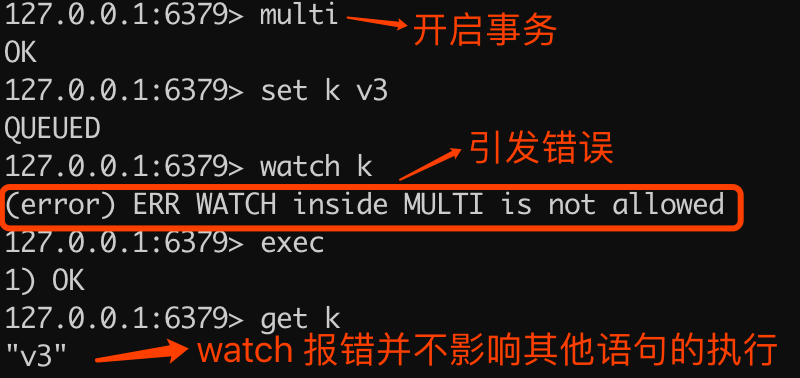

# 16 Redis 事务深入解析

> 作为关系型数据库中一项非常重要的基础功能——事务，在 Redis 中是如何处理并使用的？

### 前言

事务指的是提供一种将多个命令打包，一次性按顺序地执行的机制，并且保证服务器只有在执行完事务中的所有命令后，才会继续处理此客户端的其他命令。

事务也是其他关系型数据库所必备的基础功能，以支付的场景为例，正常情况下只有正常消费完成之后，才会减去账户余额。但如果没有事务的保障，可能会发生消费失败了，但依旧会把账户的余额给扣减了，我想这种情况应该任何人都无法接受吧？所以事务是数据库中一项非常重要的基础功能。

### 事务基本使用

事务在其他语言中，一般分为以下三个阶段：

- 开启事务——Begin Transaction
- 执行业务代码，提交事务——Commit Transaction
- 业务处理中出现异常，回滚事务——Rollback Transaction

以 Java 中的事务执行为例：

```java
// 开启事务
begin();
try {
    //......
    // 提交事务
    commit();
} catch(Exception e) {
    // 回滚事务
    rollback();
}
```

Redis 中的事务从开始到结束也是要经历三个阶段：

- **开启事务**
- **命令入列**
- **执行事务/放弃事务**

其中，==开启事务使用 multi 命令，事务执行使用 exec 命令，放弃事务使用 discard 命令==。

#### **开启事务**

multi 命令用于开启事务，实现代码如下：

```shell
> multi
OK
```

multi 命令可以让客户端从非事务模式状态，变为事务模式状态，如下图所示：



**注意**：multi 命令不能嵌套使用，如果已经开启了事务的情况下，再执行 multi 命令，会提示如下错误：

```
(error) ERR MULTI calls can not be nested
```

执行效果，如下代码所示：

```shell
127.0.0.1:6379> multi
OK
127.0.0.1:6379> multi
(error) ERR MULTI calls can not be nested
```

当客户端是非事务状态时，使用 multi 命令，客户端会返回结果 OK，如果客户端已经是事务状态，再执行 multi 命令会提示multi 命令不能嵌套的错误，但不会终止客户端为事务的状态，如下图所示：



#### **命令入列**

客户端进入事务状态之后，执行的所有常规 Redis 操作命令（非触发事务执行或放弃和导致入列异常的命令）会依次入列，命令入列成功后会返回 QUEUED，如下代码所示：

```shell
> multi
OK
> set k v
QUEUED
> get k
QUEUED
```

执行流程如下图所示：



**注意**：命令会按照先进先出（FIFO）的顺序出入列，也就是**说事务会按照命令的入列顺序，从前往后依次执行**。

#### **执行事务/放弃事务**

执行事务的命令是 exec，放弃事务的命令是 discard。

执行事务示例代码如下：

```shell
> multi
OK
> set k v2
QUEUED
> exec
1) OK
> get k
"v2"
```

放弃事务示例代码如下：

```shell
> multi
OK
> set k v3
QUEUED
> discard
OK
> get k
"v2"
```

执行流程如下图所示：



### 事务错误&回滚

事务执行中的错误分为以下三类：

- **执行时才会出现的错误（简称：执行时错误）；**
- **入列时错误，不会终止整个事务；**
- **入列时错误，会终止整个事务。**

#### **执行时错误**

示例代码如下：

```shell
> get k
"v"
> multi
OK
> set k v2
QUEUED
> expire k 10s
QUEUED
> exec
1) OK
2) (error) ERR value is not an integer or out of range
> get k
"v2"
```

执行命令解释如下图所示：



从以上结果可以看出，**即使事务队列中某个命令在执行期间发生了错误，事务也会继续执行，直到事务队列中所有命令执行完成**。

#### **入列错误不会导致事务结束**

示例代码如下：

```shell
> get k
"v"
> multi
OK
> set k v2
QUEUED
> multi
(error) ERR MULTI calls can not be nested
> exec
1) OK
> get k
"v2"
```

执行命令解释如下图所示：



可以看出，重复执行 multi 会导致入列错误，但不会终止事务，最终查询的结果是事务执行成功了。除了*重复执行 multi 命令，还有在事务状态下执行 watch 也是同样的效果*，下文会详细讲解关于 watch 的内容。

#### **入列错误导致事务结束**

示例代码如下：

```shell
> get k
"v2"
> multi
OK
> set k v3
QUEUED
> set k
(error) ERR wrong number of arguments for 'set' command
> exec
(error) EXECABORT Transaction discarded because of previous errors.
> get k
"v2"
```

执行命令解释如下图所示：



#### **为什么不支持事务回滚？**

Redis 官方文档的解释如下：

> If you have a relational databases background, the fact that Redis commands can fail during a transaction, but still Redis will execute the rest of the transaction instead of rolling back, may look odd to you.
>
> However there are good opinions for this behavior:
>
> - Redis commands can fail only if called with a wrong syntax (and the problem is not detectable during the command queueing), or against keys holding the wrong data type: this means that in practical terms a failing command is the result of a programming errors, and a kind of error that is very likely to be detected during development, and not in production.
> - Redis is internally simplified and faster because it does not need the ability to roll back.
>
> An argument against Redis point of view is that bugs happen, however it should be noted that in general the roll back does not save you from programming errors. For instance if a query increments a key by 2 instead of 1, or increments the wrong key, there is no way for a rollback mechanism to help. Given that no one can save the programmer from his or her errors, and that the kind of errors required for a Redis command to fail are unlikely to enter in production, we selected the simpler and faster approach of not supporting roll backs on errors.

大概的意思是，作者不支持事务回滚的原因有以下两个：

- 他认为 Redis 事务的执行时，错误通常都是编程错误造成的，这种错误通常只会出现在开发环境中，而很少会在实际的生产环境中出现，所以他认为没有必要为 Redis 开发事务回滚功能；
- 不支持事务回滚是因为这种复杂的功能和 Redis 追求的简单高效的设计主旨不符合。

这里不支持事务回滚，指的是**不支持运行时错误的事务回滚**。

### 监控

watch 命令用于客户端并发情况下，为事务提供一个乐观锁（CAS，Check And Set），也就是可以用 watch 命令来监控一个或多个变量，如果在事务的过程中，某个**监控项被修改**了，那么**整个事务**就会**终止执行**。

watch 基本语法如下：

```
watch key [key ...]
```

`watch` 示例代码如下：

```shell
> watch k
OK
> multi
OK
> set k v2
QUEUED
> exec
(nil)
> get k
"v"
```

**注意**：以上事务在执行期间，也就是开启事务（multi）之后，执行事务（exec）之前，模拟多客户端并发操作了变量 k 的值，这个时候再去执行事务，才会出现如上结果，exec 执行的结果为 nil。

可以看出，当执行 exec 返回的结果是 nil 时，表示 watch 监控的对象在事务执行的过程中被修改了。从 `get k` 的结果也可以印证，因为事务中设置的值 `set k v2` 并未正常执行。

执行流程如下图所示：



**注意**： watch 命令只能在客户端开启事务之前执行，在事务中执行 watch 命令会引发错误，但不会造成整个事务失败，如下代码所示：

```shell
> multi
OK
> set k v3
QUEUED
> watch k
(error) ERR WATCH inside MULTI is not allowed
> exec
1) OK
> get k
"v3"
```

执行命令解释如下图所示：



unwatch 命令用于清除所有之前监控的所有对象（键值对）。

unwatch 示例如下所示：

```shell
> set k v
OK
> watch k
OK
> multi
OK
> unwatch
QUEUED
> set k v2
QUEUED
> exec
1) OK
2) OK
> get k
"v2"
```

可以看出，即使在事务的执行过程中，k 值被修改了，因为调用了 unwatch 命令，整个事务依然会顺利执行。

### 代码实战

以下是事务在 Java 中的使用，代码如下：

```java
import redis.clients.jedis.Jedis;
import redis.clients.jedis.Transaction;

public class TransactionExample {
    public static void main(String[] args) {
        // 创建 Redis 连接
        Jedis jedis = new Jedis("xxx.xxx.xxx.xxx", 6379);
        // 设置 Redis 密码
        jedis.auth("xxx");
        // 设置键值
        jedis.set("k", "v");
        // 开启监视 watch
        jedis.watch("k");
        // 开始事务
        Transaction tx = jedis.multi();
        // 命令入列
        tx.set("k", "v2");
        // 执行事务
        tx.exec();
        System.out.println(jedis.get("k"));
        jedis.close();
    }
}
```

### 知识点练习

#### **以下两个客户端交替执行的结果是？**

客户端一，执行如下命令：

```shell
> set k v
OK
> watch k
OK
> multi
OK
> set k v2
QUEUED
```

客户端二，执行如下命令：

```shell
> set k v
OK
```

客户端一，再执行如下命令：

```shell
> exec
```

此时 k 的值为多少？

答： k 的值为 v，而非 v2。

题目解析：本题考查的是 watch 命令监控时，即使把原对象的值重新赋值给了原对象，这个时候 watch 命令也会认为监控对象还是被修改了。

### 小结

事务为多个命令提供一次性按顺序执行的机制，与 Redis 事务相关的命令有以下五个：

- **multi：开启事务**
- **exec：执行事务**
- **discard：丢弃事务**
- **watch：为事务提供乐观锁实现**
- **unwatch：取消监控（取消事务中的乐观锁）**

正常情况下 Redis 事务分为三个阶段：开启事务、命令入列、执行事务。Redis 事务并不支持运行时错误的事务回滚，但在某些入列错误，如 `set key` 或者是 `watch` 监控项被修改时，提供整个事务回滚的功能。