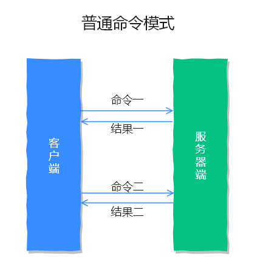
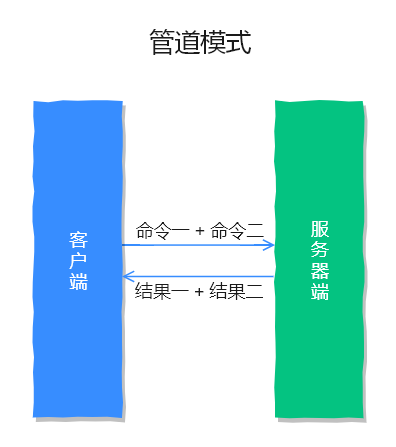

# 19 Redis 管道技术——Pipeline

管道技术（Pipeline）是客户端提供的一种批处理技术，用于一次处理多个 Redis 命令，从而提高整个交互的性能。

通常情况下 Redis 是单行执行的，客户端先向服务器发送请求，服务端接收并处理请求后再把结果返回给客户端，这种处理模式在非频繁请求时不会有任何问题。

但如果出现集中大批量的请求时，因为每个请求都要经历先请求再响应的过程，这就会造成网络资源浪费，此时就需要管道技术来把所有的命令整合一次发给服务端，再一次响应给客户端，这样就能大大的提升了 Redis 的响应速度。

普通命令模式，如下图所示：



管道模式，如下图所示：



> 小贴士：管道中命令越多，管道技术的作用就更大，相比于普通模式来说执行效率就越高。

### 管道技术解决了什么问题？

管道技术解决了多个命令集中请求时造成网络资源浪费的问题，加快了 Redis 的响应速度，让 Redis 拥有更高的运行速度。但要注意的一点是，管道技术本质上是客户端提供的功能，而非 Redis 服务器端的功能。

### 管道技术使用

本文我们使用 Jedis 客户端提供的 Pipeline 对象来实现管道技术。首先先获取 Pipeline 对象，再为 Pipeline 对象设置需要执行的命令，最后再使用 sync() 方法或 syncAndReturnAll() 方法来统一执行这些命令，代码如下：

```java
public class PipelineExample {
    public static void main(String[] args) {
        Jedis jedis = new Jedis("127.0.0.1", 6379);
        // 记录执行开始时间
        long beginTime = System.currentTimeMillis();
        // 获取 Pipeline 对象
        Pipeline pipe = jedis.pipelined();
        // 设置多个 Redis 命令
        for (int i = 0; i < 100; i++) {
            pipe.set("key" + i, "val" + i);
            pipe.del("key"+i);
        }
        // 执行命令
        pipe.sync();
        // 记录执行结束时间
        long endTime = System.currentTimeMillis();
        System.out.println("执行耗时：" + (endTime - beginTime) + "毫秒");
    }
}
```

以上程序执行结果如下：

```
执行耗时：297毫秒
```

如果要接收管道所有命令的执行结果，可使用 syncAndReturnAll() 方法，示例代码如下：

```java
public class PipelineExample {
    public static void main(String[] args) {
        Jedis jedis = new Jedis("127.0.0.1", 6379);
        // 获取 Pipeline 对象
        Pipeline pipe = jedis.pipelined();
        // 设置多个 Redis 命令
        for (int i = 0; i < 100; i++) {
            pipe.set("key" + i, "val" + i);
        }
        // 执行命令并返回结果
        List<Object> res = pipe.syncAndReturnAll();
        for (Object obj : res) {
            // 打印结果
            System.out.println(obj);
        }
    }
}
```

### 管道技术 VS 普通命令

上面使用管道技术执行一个 for 循环所用的时间为 297 毫秒，接下来我们用普通的命令执行此循环，看下程序的执行时间，代码如下：

```java
public class PipelineExample {
    public static void main(String[] args) {
        Jedis jedis = new Jedis("127.0.0.1", 6379);
        // 记录执行开始时间
        long beginTime = System.currentTimeMillis();
        for (int i = 0; i < 100; i++) {
            jedis.set("key" + i, "val" + i);
            jedis.del("key"+i);
        }
        // 记录执行结束时间
        long endTime = System.currentTimeMillis();
        System.out.println("执行耗时：" + (endTime - beginTime) + "毫秒");
    }
}
```

以上程序执行结果如下：

```
执行耗时：17276毫秒
```

**结论**

从上面的结果可以看出，管道的执行时间是 297 毫秒，而普通命令执行时间是 17276 毫秒，管道技术要比普通的执行快了 58 倍。

### 管道技术需要注意的事项

管道技术虽然有它的优势，但在使用时还需注意以下几个细节：

- 发送的命令数量不会被限制，但输入缓存区也就是命令的最大存储体积为 1GB，当发送的命令超过此限制时，命令不会被执行，并且会被 Redis 服务器端断开此链接；
- 如果管道的数据过多可能会导致客户端的等待时间过长，导致网络阻塞；
- 部分客户端自己本身也有缓存区大小的设置，如果管道命令没有没执行或者是执行不完整，可以排查此情况或较少管道内的命令重新尝试执行。

### 小结

使用管道技术可以解决多个命令执行时的网络等待，它是把多个命令整合到一起发送给服务器端处理之后统一返回给客户端，这样就免去了每条命令执行后都要等待的情况，从而有效地提高了程序的执行效率，但使用管道技术也要注意避免发送的命令过大，或管道内的数据太多而导致的网络阻塞。