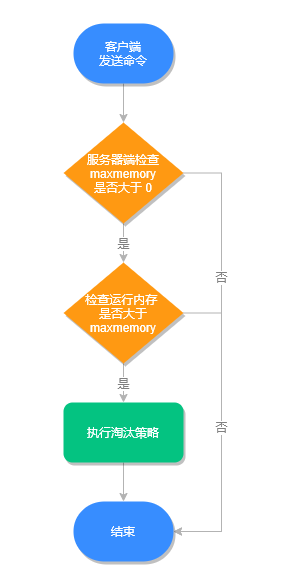

# 23 内存淘汰机制与算法

在本文开始之前，我们先要明白：在 Redis 中，过期策略和内存淘汰策略两个完全不同的概念，但很多人会把两者搞混。

首先，Redis 过期策略指的是 Redis 使用那种策略，来删除已经过期的键值对；而 Redis 内存淘汰机制指的是，当 Redis 运行内存已经超过 Redis 设置的最大内存之后，将采用什么策略来删除符合条件的键值对，以此来保障 Redis 高效的运行。

过期策略前面的文章，我们已经详细地讲过了，本文我们重点来看 Redis 的内存淘汰机制。

### Redis 最大运行内存

只有在 Redis 的运行内存达到了某个阀值，才会触发内存淘汰机制，这个阀值就是我们设置的最大运行内存，此值在 Redis 的配置文件中可以找到，配置项为 maxmemory。

内存淘汰执行流程，如下图所示：



#### **查询最大运行内存**

我们可以使用命令 `config get maxmemory` 来查看设置的最大运行内存，命令如下：

```shell
127.0.0.1:6379> config get maxmemory
1) "maxmemory"
2) "0"
```

我们发现此值竟然是 0，这是 64 位操作系统默认的值，当 maxmemory 为 0 时，表示没有内存大小限制。

> 小贴士：32 位操作系统，默认的最大内存值是 3GB。

### 内存淘汰策略

#### **查看 Redis 内存淘汰策略**

我们可以使用 `config get maxmemory-policy` 命令，来查看当前 Redis 的内存淘汰策略，命令如下：

```shell
127.0.0.1:6379> config get maxmemory-policy
1) "maxmemory-policy"
2) "noeviction"
```

可以看出此 Redis 使用的是 noeviction 类型的内存淘汰机制，它表示当运行内存超过最大设置内存时，不淘汰任何数据，但新增操作会报错。

#### **内存淘汰策略分类**

早期版本的 Redis 有以下 6 种淘汰策略：

1. **noeviction**：不淘汰任何数据，当内存不足时，新增操作会报错，Redis 默认内存淘汰策略；
2. **allkeys-lru**：淘汰整个键值中最久未使用的键值；
3. **allkeys-random**：随机淘汰任意键值;
4. **volatile-lru**：淘汰所有设置了过期时间的键值中最久未使用的键值；
5. **volatile-random**：随机淘汰设置了过期时间的任意键值；
6. **volatile-ttl**：优先淘汰更早过期的键值。

在 Redis 4.0 版本中又新增了 2 种淘汰策略：

1. **volatile-lfu**：淘汰所有设置了过期时间的键值中，最少使用的键值；
2. **allkeys-lfu**：淘汰整个键值中最少使用的键值。

其中 allkeys-xxx 表示从所有的键值中淘汰数据，而 volatile-xxx 表示从设置了过期键的键值中淘汰数据。

#### **修改 Redis 内存淘汰策略**

设置内存淘汰策略有两种方法，这两种方法各有利弊，需要使用者自己去权衡。

- 方式一：通过“config set maxmemory-policy 策略”命令设置。它的优点是设置之后立即生效，不需要重启 Redis 服务，缺点是重启 Redis 之后，设置就会失效。
- 方式二：通过修改 Redis 配置文件修改，设置“maxmemory-policy 策略”，它的优点是重启 Redis 服务后配置不会丢失，缺点是必须重启 Redis 服务，设置才能生效。

### 内存淘汰算法

从内测淘汰策略分类上，我们可以得知，除了随机删除和不删除之外，主要有两种淘汰算法：LRU 算法和 LFU 算法。

#### **LRU 算法**

LRU 全称是 Least Recently Used 译为最近最少使用，是一种常用的页面置换算法，选择最近最久未使用的页面予以淘汰。

**1. LRU 算法实现**

LRU 算法需要基于链表结构，链表中的元素按照操作顺序从前往后排列，最新操作的键会被移动到表头，当需要内存淘汰时，只需要删除链表尾部的元素即可。

**2. 近 LRU 算法**

Redis 使用的是一种近似 LRU 算法，目的是为了更好的节约内存，它的实现方式是给现有的数据结构添加一个额外的字段，用于记录此键值的最后一次访问时间，Redis 内存淘汰时，会使用随机采样的方式来淘汰数据，它是随机取 5 个值（此值可配置），然后淘汰最久没有使用的那个。

**3. LRU 算法缺点**

LRU 算法有一个缺点，比如说很久没有使用的一个键值，如果最近被访问了一次，那么它就不会被淘汰，即使它是使用次数最少的缓存，那它也不会被淘汰，因此在 Redis 4.0 之后引入了 LFU 算法，下面我们一起来看。

#### **LFU 算法**

LFU 全称是 Least Frequently Used 翻译为最不常用的，最不常用的算法是根据总访问次数来淘汰数据的，它的核心思想是“如果数据过去被访问多次，那么将来被访问的频率也更高”。

LFU 解决了偶尔被访问一次之后，数据就不会被淘汰的问题，相比于 LRU 算法也更合理一些。

在 Redis 中每个对象头中记录着 LFU 的信息，源码如下：

```c
typedef struct redisObject {
    unsigned type:4;
    unsigned encoding:4;
    unsigned lru:LRU_BITS; /* LRU time (relative to global lru_clock) or
                            * LFU data (least significant 8 bits frequency
                            * and most significant 16 bits access time). */
    int refcount;
    void *ptr;
} robj;
```

在 Redis 中 LFU 存储分为两部分，16 bit 的 ldt（last decrement time）和 8 bit 的 logc（logistic counter）。

1. logc 是用来存储访问频次，8 bit 能表示的最大整数值为 255，它的值越小表示使用频率越低，越容易淘汰；
2. ldt 是用来存储上一次 logc 的更新时间。

### 小结

通过本文我们了解到，Redis 内存淘汰策略和过期回收策略是完全不同的概念，内存淘汰策略是解决 Redis 运行内存过大的问题的，通过与 maxmemory 比较，决定要不要淘汰数据，根据 maxmemory-policy 参数，决定使用何种淘汰策略，在 Redis 4.0 之后已经有 8 种淘汰策略了，默认的策略是 noeviction 当内存超出时不淘汰任何键值，只是新增操作会报错。